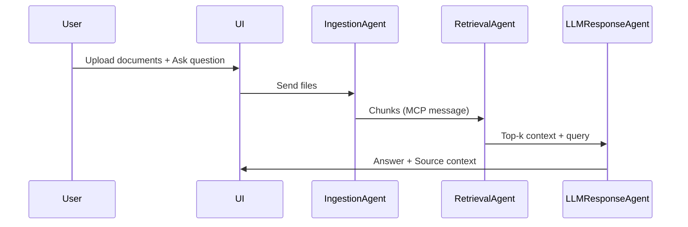
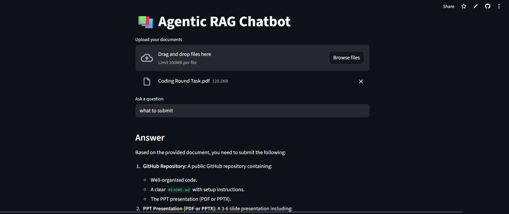

# 🤖 Agentic RAG Chatbot with Multi-Format Document QA (MCP-based)

This project implements a **Retrieval-Augmented Generation (RAG) chatbot** with a modular **agent-based architecture**. It supports **multi-format document uploads** and uses the **Model Context Protocol (MCP)** for communication between agents. The chatbot can answer user questions using uploaded PDFs, DOCX, PPTX, CSV, and TXT/Markdown files.

---

## 🧠 Architecture Overview

The system is divided into **three core agents**, each communicating via structured MCP messages:

```
User → IngestionAgent → RetrievalAgent → LLMResponseAgent → Answer
```

Each agent sends and receives MCP-style messages like:
```json
{
  "sender": "RetrievalAgent",
  "receiver": "LLMResponseAgent",
  "type": "RETRIEVAL_RESULT",
  "trace_id": "rag-123",
  "payload": {
    "retrieved_context": ["chunk1...", "chunk2..."],
    "query": "What KPIs were tracked in Q1?"
  }
}
```

---

## 🧱 Agent Roles

### 1. 🔍 IngestionAgent
- Parses uploaded documents (PDF, DOCX, PPTX, CSV, TXT/MD).
- Extracts and chunks text for further processing.

### 2. 📥 RetrievalAgent
- Embeds document chunks using **sentence-transformers**.
- Stores chunks in a **FAISS vector database**.
- Performs semantic similarity search to return relevant content.

### 3. 🤖 LLMResponseAgent
- Builds a prompt using retrieved chunks + query.
- Calls **OpenAI GPT-3.5** to generate a final answer.
- Sends answer and source context back to the user.

---

## 📊 System Flow Diagram



---

## 🖥️ User Interface (Streamlit)

The frontend is built using **Streamlit**, offering:
- 📤 Multi-document upload
- ❓ Text input for multi-turn questions
- 📑 Answer display with source context

---

## 🧰 Tech Stack

| Component | Technology |
|----------|-------------|
| UI       | Streamlit |
| Agents   | Python classes |
| Embeddings | HuggingFace `all-MiniLM-L6-v2` |
| Vector DB | FAISS |
| LLM      | OpenAI GPT-3.5 |
| Parsing  | PyMuPDF, python-docx, python-pptx, pandas |

---

## 🚀 Getting Started

### 1. Clone the repo
```bash
git clone https://github.com/your-username/agentic-rag-chatbot.git
cd agentic-rag-chatbot
```

### 2. Install dependencies
```bash
pip install -r requirements.txt
```

### 3. Set your OpenAI API key
```bash
export OPENAI_API_KEY=your-api-key
```

### 4. Run the app
```bash
streamlit run ui/app.py
```

---

## 📁 File Structure

```
agentic_rag_chatbot/
├── agents/
│   ├── ingestion_agent.py
│   ├── retrieval_agent.py
│   └── llm_response_agent.py
├── mcp/
│   └── message.py
├── utils/
│   └── parser.py
├── ui/
│   └── app.py
├── requirements.txt
└── README.md
```

---

## 📸 Screenshots


---

## 🧪 Sample Use Case

**Uploaded Files**: `metrics.csv`, `q1_review.pdf`  
**Query**: “What KPIs were tracked in Q1?”  
**Answer**: “The tracked KPIs include retention rate, revenue, and conversion ratio.”  
**Sources**: `metrics.csv`, `q1_review.pdf` (slide 2)

---

## ⚙️ Challenges Faced

- Ensuring compatibility across diverse document types
- Managing embeddings for large document sets
- Handling message flow between asynchronous agents

---

## 📈 Future Improvements

- Add summarization and ranking agents
- Use WebSockets for real-time updates
- Expand to multilingual document QA

---

## 📜 License

MIT License

---

## 🤝 Acknowledgments

- OpenAI for GPT APIs
- HuggingFace for pretrained sentence-transformers
- Streamlit for easy UI integration
